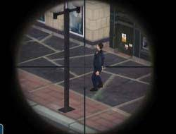
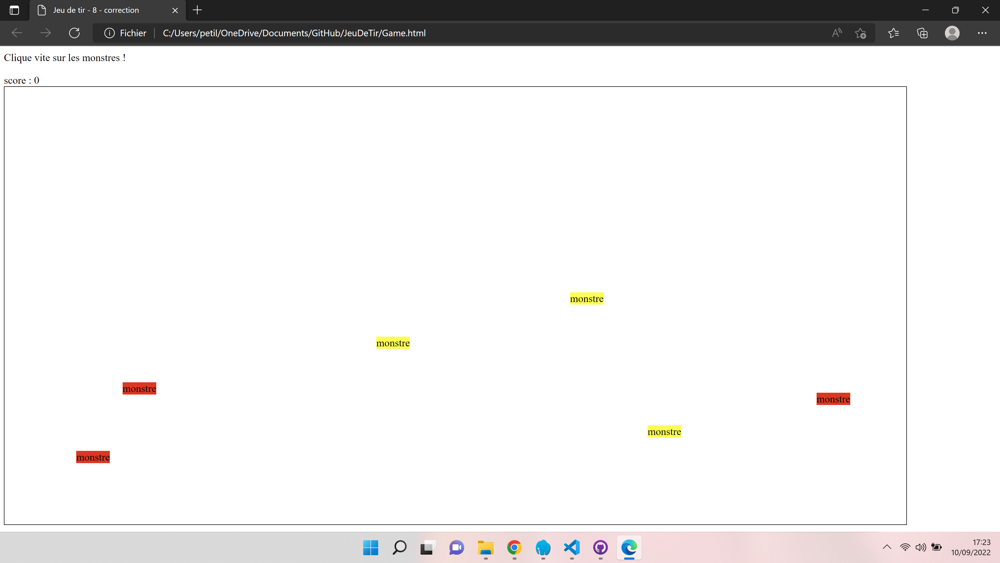

<h1 align="center">
  
</h1>

---

# Site Portfolio

## Petit résumé

- Le javascript permet aujourd'hui un très grand nombre de possibilitées. 

## Objectifs

- Se familiariser avec le javascript.
- Réaliser un jeu fps dans un navigateur web.

## Techno

- HTML
- CSS
- Javascript

## UI

## Auteur

- [@Pierre](https://github.com/Pierre-Portfolio)